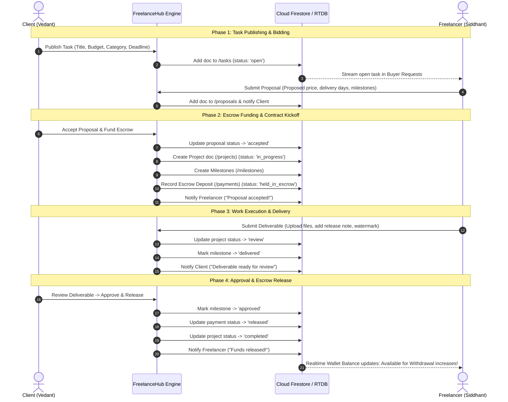

# FreelanceHub — Full System Documentation

A modern, production-grade cross-platform freelance marketplace application built with **Flutter** and powered by **Google Firebase** (Authentication, Cloud Firestore, Realtime Database, Cloud Storage).

---

## Table of Contents
1. [System Architecture](#1-system-architecture)
2. [Dual-Role Marketplace Model](#2-dual-role-marketplace-model)
3. [End-to-End User Workflows](#3-end-to-end-user-workflows)
   - [Workflow A: Authentication & Onboarding](#workflow-a-authentication--onboarding)
   - [Workflow B: Client Task Creation & Marketplace Publishing](#workflow-b-client-task-creation--marketplace-publishing)
   - [Workflow C: Freelancer Discovery & Proposal Submission](#workflow-c-freelancer-discovery--proposal-submission)
   - [Workflow D: Proposal Review, Negotiation & Escrow Funding](#workflow-d-proposal-review-negotiation--escrow-funding)
   - [Workflow E: Contract Execution & Work Delivery](#workflow-e-contract-execution--work-delivery)
   - [Workflow F: Milestone Review & Escrow Release](#workflow-f-milestone-review--escrow-release)
   - [Workflow G: Freelancer Earnings & Withdrawal](#workflow-g-freelancer-earnings--withdrawal)
   - [Workflow H: Real-Time 1-on-1 Messaging & Live Presence](#workflow-h-real-time-1-on-1-messaging--live-presence)
4. [File & Directory Architecture](#4-file--directory-architecture)
5. [Data Models & Firestore / RTDB Schemas](#5-data-models--firestore--rtdb-schemas)
6. [Services & Business Logic Layer](#6-services--business-logic-layer)
7. [Repositories Layer (Data Access)](#7-repositories-layer-data-access)
8. [Screen Inventory & User Journeys](#8-screen-inventory--user-journeys)
9. [Design System & UI Components](#9-design-system--ui-components)
10. [Firebase Security Rules & Cloud Configuration](#10-firebase-security-rules--cloud-configuration)
11. [Setup, Testing & Release Guide](#11-setup-testing--release-guide)

---

## 1. System Architecture

FreelanceHub is engineered following clean architectural principles with strict separation of concerns into four decoupled layers:

```
┌─────────────────────────────────────────────────────────────┐
│                       PRESENTATION                          │
│     17 Interactive Screens • Material 3 • Lucide Icons      │
└──────────────────────────────┬──────────────────────────────┘
                               │ UI Events / Subscriptions
┌──────────────────────────────▼──────────────────────────────┐
│                      SERVICES LAYER                         │
│   AuthService • ClientService • NotificationService         │
│         (Orchestration & Business Logic Workflows)          │
└──────────────────────────────┬──────────────────────────────┘
                               │ Typed Method Calls
┌──────────────────────────────▼──────────────────────────────┐
│                    REPOSITORIES LAYER                       │
│ TaskRepo • ProposalRepo • ProjectRepo • MilestoneRepo       │
│ PaymentRepo • MessageRepo • NotificationRepo • ReviewRepo   │
└──────────────────────────────┬──────────────────────────────┘
                               │ Stream / Future Snapshots
┌──────────────────────────────▼──────────────────────────────┐
│                  DATA CONTRACTS & FIREBASE                  │
│ Models (fromFirestore / toMap) • FirebaseConfig (Singleton) │
│ Cloud Firestore • Realtime Database • Auth • Storage Bucket │
└─────────────────────────────────────────────────────────────┘
```

- **Cloud Firestore**: Primary persistent document store for users, profiles, tasks, proposals, projects, milestones, payments, and reviews.
- **Firebase Realtime Database**: Low-latency WebSocket connections for 1-on-1 direct messaging, online presence indicators, and typing status.
- **Firebase Authentication**: Email/Password authentication with automatic role identification (`client` vs `freelancer`).
- **Cloud Storage**: Secure binary hosting for deliverable packages (`.zip`), project assets, and portfolio attachments.

---

## 2. Dual-Role Marketplace Model

FreelanceHub differentiates user experiences into two specialized role interfaces:

### The Client (e.g., Vedant)
- **Primary Goal**: Post tasks, review applicant bids, fund escrow, manage deliverables, and release payments.
- **Dedicated Hub**: `ClientHomeScreen` with active project stats, actionable review banners, and an AI Brief Writer assistant.
- **Financial Role**: Funds milestone escrow securely; holds 100% protection until deliverables meet quality standards.

### The Freelancer (e.g., Siddhant)
- **Primary Goal**: Discover opportunities, send competitive proposals with milestone schedules, submit deliverables, and withdraw funds.
- **Dedicated Hub**: `FreelancerDashboardScreen` displaying real-time wallet balances, monthly earnings, pending clearances, and active orders.
- **Financial Role**: Receives instant escrow payouts upon client approval with transparent 10% marketplace fees and zero-delay withdrawal access.

---

## 3. End-to-End User Workflows



### Detailed Breakdown of Workflows

#### Workflow A: Authentication & Onboarding
1. User enters Email and Password on `LoginScreen` or `SignupScreen`.
2. Role is selected (`Client` or `Freelancer`).
3. If Freelancer:
   - Guided through `FreelancerOnboardingScreen` (Professional title, bio, hourly rate, services).
   - Advances to `FreelancerOnboardingStep2Screen` (Core skills selection, years of experience, portfolio).
   - Status saved to Firestore `/freelancers/{uid}`.
4. If Client:
   - Account saved to Firestore `/clients/{uid}` with business information.

#### Workflow B: Client Task Creation & Marketplace Publishing
1. Client taps `+ Post a Task` on `ClientHomeScreen` or navigates to `/post-task`.
2. Form captures:
   - **Title & Description**: High-fidelity project scope.
   - **Category**: Tech, Design, Writing, Video, Marketing.
   - **Budget & Type**: Fixed Price vs. Hourly rate.
   - **Deadline & Experience**: Delivery deadline and minimum experience level.
   - **Required Skills**: Tag-based chip selection (Flutter, Dart, Firebase, UI/UX).
3. Client taps **Publish Task**. `ClientService.postTask()` persists the task to `/tasks` with `status: 'open'`.

#### Workflow C: Freelancer Discovery & Proposal Submission
1. Freelancers view live listings on `BuyerRequestsScreen` with category chips and search.
2. Tapping **Send Offer** on an opportunity opens `SendOfferScreen`.
3. Freelancer enters:
   - Total bid amount and estimated delivery days.
   - Detailed cover letter / pitch.
   - Structured milestones breakdown (Phase name, price, duration).
4. Tapping **Submit Proposal** writes to `/proposals` with `status: 'pending'`.

#### Workflow D: Proposal Review, Negotiation & Escrow Funding
1. Client opens `TaskDetailsProposalsScreen` to inspect all proposals submitted to their task.
2. Client can:
   - **Message Candidate**: Opens direct real-time chat with pre-loaded project context.
   - **Shortlist Candidate**: Stars candidate for comparison.
   - **Accept Offer**: Launches escrow confirmation modal.
3. Upon confirmation, `ClientService.acceptProposal()` atomically:
   - Sets proposal status to `'accepted'`.
   - Creates a new contract in `/projects` (status: `'in_progress'`).
   - Generates `/milestones` entries.
   - Deposits total funds into escrow `/payments` with `status: 'held_in_escrow'`.
   - Sends real-time notification to the freelancer.

#### Workflow E: Contract Execution & Work Delivery
1. Contract appears in Freelancer's `FreelancerOrdersScreen` and `ProjectWorkspaceScreen`.
2. When work is finished, Freelancer taps **Deliver Work** opening `OrderDeliveryScreen`.
3. Freelancer attaches final files (or links), adds completion notes, toggles watermark protection, and submits.
4. `ProjectRepository.updateProjectStatus(projectId, 'review')` sets the project to review status and client is notified.

#### Workflow F: Milestone Review & Escrow Release
1. Client receives notification and sees actionable banner on `ClientHomeScreen` or `ProjectWorkspaceScreen`.
2. Tapping **Review Submission** allows client to inspect files and choose:
   - **Request Changes**: Reverts project status to `'revision'` with change request notes.
   - **Approve & Release**: Triggers `ClientService.reviewMilestoneDeliverable(approved: true)`.
3. Approval executes:
   - Updates milestone status to `'approved'`.
   - Updates payment record status from `'held_in_escrow'` to `'released'`.
   - Updates project status to `'completed'`.
   - Automatically provisions a release payment record if missing.
   - Sends push notification to the freelancer.

#### Workflow G: Freelancer Earnings & Withdrawal
1. `FreelancerDashboardScreen` streams payments and active projects via `_recalculateEarnings()`.
2. Funds are immediately reflected in:
   - **Available for Withdrawal**: Instant balance ready for payout.
   - **Earned This Month**: Cumulative earnings.
   - **In Escrow / Pending Clearance**: Decremented accordingly.
3. Freelancer can tap **Withdraw Balance** to transfer earnings to a bank card or account.

#### Workflow H: Real-Time 1-on-1 Messaging & Live Presence
1. Initiated from applicant proposals, order workspace, or `MessagesInboxScreen`.
2. `IndividualChatScreen` maintains an active WebSocket link to Firebase Realtime Database:
   - Pinned project context card displays budget, contract ID, and delivery state.
   - Instant message transmission with timestamps.
   - Typing indicators (`isTyping`) and online status.

---

## 4. File & Directory Architecture

```
freelancehub/
├── android/                        # Android native project and Gradle configuration
├── assets/images/                  # Static artwork, logos, and onboarding illustrations
├── docs/                           # Design specifications (design.md)
├── functions/                      # Firebase Cloud Functions (if deployed)
├── ios/                            # iOS native project and CocoaPods configuration
├── lib/
│   ├── core/
│   │   ├── errors/
│   │   │   └── app_exception.dart  # Centralized error mapping and exception handler
│   │   ├── firebase/
│   │   │   └── firebase_config.dart # Firebase initialization, instances, and settings
│   │   ├── services/
│   │   │   └── firebase_service.dart# Global service registry and repository access
│   │   └── theme/
│   │       └── app_colors.dart     # Hex design tokens and color palette
│   ├── models/
│   │   ├── milestone_model.dart    # Milestone entity contract
│   │   ├── payment_model.dart      # Escrow and transaction entity contract
│   │   ├── project_model.dart      # Project / Contract contract
│   │   ├── proposal_model.dart     # Bid / Offer entity contract
│   │   ├── review_model.dart       # Client rating and feedback contract
│   │   ├── task_model.dart         # Marketplace project task contract
│   │   └── user_model.dart         # Authentication profile contract
│   ├── repositories/
│   │   ├── message_repository.dart # Realtime Database 1-on-1 chat operations
│   │   ├── milestone_repository.dart# Milestone deliverables and approvals
│   │   ├── notification_repository.dart # In-app notification streaming
│   │   ├── payment_repository.dart # Escrow deposits and release operations
│   │   ├── project_repository.dart # Contract status and deliverable submissions
│   │   ├── proposal_repository.dart# Proposal bidding and shortlist operations
│   │   ├── review_repository.dart  # Client reviews and rating aggregations
│   │   └── task_repository.dart    # Client task CRUD and marketplace queries
│   ├── screens/
│   │   ├── buyer_requests_screen.dart           # Freelancer opportunity marketplace
│   │   ├── client_home_screen.dart              # Client dashboard & action center
│   │   ├── escrow_payments_screen.dart          # 2x2 Bento escrow overview & releases
│   │   ├── freelancer_dashboard_screen.dart     # Freelancer earnings & contract hub
│   │   ├── freelancer_onboarding_screen.dart    # Freelancer profile setup (Step 1)
│   │   ├── freelancer_onboarding_step2_screen.dart # Skills & portfolio wizard (Step 2)
│   │   ├── freelancer_orders_screen.dart        # Order status list & tracking
│   │   ├── individual_chat_screen.dart          # Live 1-on-1 chat with contract bar
│   │   ├── login_screen.dart                    # User authentication login
│   │   ├── messages_inbox_screen.dart           # Active conversation threads
│   │   ├── order_delivery_screen.dart           # Work package submission & watermarking
│   │   ├── post_task_screen.dart                # Publish new project opportunity
│   │   ├── project_workspace_screen.dart        # Project contract & milestone tracker
│   │   ├── send_offer_screen.dart               # Bid & milestone proposal composer
│   │   ├── signup_screen.dart                   # Role-based user registration
│   │   ├── splash_screen.dart                   # Startup router and branding splash
│   │   └── task_details_proposals_screen.dart   # Proposal evaluation & escrow kickoff
│   ├── services/
│   │   ├── auth_service.dart       # User authentication & role management
│   │   ├── client_service.dart     # Core business orchestration engine
│   │   └── notification_service.dart# Event-driven user alert generator
│   ├── firebase_options.dart       # FlutterFire CLI generated credentials
│   └── main.dart                   # Application entrypoint and route table
├── test/
│   ├── firebase_service_layer_test.dart # Unit tests for services and repositories
│   └── widget_test.dart            # Widget tests for all 17 screens
├── database.rules.json             # Realtime Database security rules
├── firestore.indexes.json          # Firestore composite indexes definition
├── firestore.rules                 # Cloud Firestore security rules
└── pubspec.yaml                    # Project metadata and dependencies
```

---

## 5. Data Models & Firestore / RTDB Schemas

### 1. `TaskModel` (`/tasks/{taskId}`)
Represents an opportunity posted by a client looking for talent.
```typescript
{
  id: string;                  // Auto-generated Firestore Document ID
  clientId: string;            // User UID of posting client
  clientName: string;          // Name of posting client (e.g. "Vedant")
  title: string;               // e.g. "Modern FinTech Wallet UI"
  description: string;         // Comprehensive brief
  category: string;            // "Tech", "Design", "Writing", etc.
  budget: number;              // Fixed or maximum budget (e.g. 1200.0)
  budgetType: string;          // 'fixed' | 'hourly'
  deadline: Timestamp;         // Target delivery timestamp
  requiredSkills: string[];    // ['Flutter', 'Dart', 'Firebase']
  attachments: string[];       // URLs to reference briefs
  experienceLevel: string;     // 'Entry', 'Mid', 'Senior'
  status: string;              // 'open' | 'in_progress' | 'completed' | 'cancelled'
  createdAt: Timestamp;
}
```

### 2. `ProposalModel` (`/proposals/{proposalId}`)
Represents a freelancer's bid submitted for a specific task.
```typescript
{
  id: string;                  // Firestore Document ID
  taskId: string;              // Reference to parent Task document
  freelancerId: string;        // User UID of bidder (e.g. Siddhant)
  freelancerName: string;      // "Siddhant Jadhav"
  freelancerTitle: string;     // "Senior Flutter Engineer"
  proposedPrice: number;       // Bid amount (e.g. 1150.0)
  deliveryTimeDays: number;    // Estimated duration (e.g. 10)
  coverLetter: string;         // Pitch text
  milestones: Array<{          // Breakdown of delivery milestones
    title: string;
    amount: number;
    description: string;
  }>;
  status: string;              // 'pending' | 'accepted' | 'rejected'
  isShortlisted: boolean;      // Client shortlist flag
  createdAt: Timestamp;
}
```

### 3. `ProjectModel` (`/projects/{projectId}`)
Represents an active or completed contract between a client and a freelancer.
```typescript
{
  id: string;                  // Firestore Document ID
  taskId: string;              // Reference to original task
  clientId: string;            // Client User UID
  clientName: string;          // Client Name
  freelancerId: string;        // Freelancer User UID
  freelancerName: string;      // Freelancer Name
  title: string;               // Project title
  budget: number;              // Total agreed contract budget
  status: string;              // 'in_progress' | 'delivered' | 'review' | 'revision' | 'completed' | 'cancelled'
  progress: number;            // 0.0 to 1.0 completion ratio
  completedMilestones: number; // e.g. 2
  totalMilestones: number;     // e.g. 3
  startedDate: Timestamp;
  dueDate: Timestamp;
  deliveredFileName?: string;  // e.g. "Deliverables_v1.zip"
  deliveredFileUrl?: string;   // Storage download URL
  deliveredFileSize?: string;  // e.g. "24.5 MB"
  deliveryNote?: string;       // Freelancer handover message
  hasWatermark?: boolean;      // Watermark protection enabled
  createdAt: Timestamp;
}
```

### 4. `PaymentModel` (`/payments/{paymentId}`)
Tracks escrow financial transactions, deposits, and payouts.
```typescript
{
  id: string;                  // Firestore Document ID
  projectId: string;           // Associated Project ID
  clientId: string;            // Client UID (depositor)
  freelancerId: string;        // Freelancer UID (payee)
  amount: number;              // Total gross amount (e.g. 400.0)
  platformFee: number;         // Marketplace platform fee (10% = 40.0)
  netAmount: number;           // Freelancer net payout (90% = 360.0)
  status: string;              // 'held_in_escrow' | 'released' | 'refunded'
  paymentMethod: string;       // 'card' | 'escrow' | 'bank'
  createdAt: Timestamp;
  releasedAt?: Timestamp;
}
```

### 5. `MessageModel` (Realtime Database: `/conversations/{convId}/messages/{msgId}`)
Real-time peer messaging between users.
```typescript
{
  id: string;                  // Push key ID
  senderId: string;            // Sender UID
  senderName: string;          // Display name
  text: string;                // Message content
  timestamp: number;           // Unix epoch milliseconds
  isDelivered: boolean;
  isRead: boolean;
  attachmentUrl?: string;
  attachmentType?: string;     // 'file' | 'image'
}
```

---

## 6. Services & Business Logic Layer

### 1. `ClientService` ([lib/services/client_service.dart](file:///Users/siddhantsmac/Desktop/flutterproject/freelancehub/lib/services/client_service.dart))
Central controller orchestrating marketplace actions:
- `postTask(...)`: Validates input and persists open opportunities.
- `acceptProposal(...)`: Accepts bids, creates contract project, sets up milestones, deposits funds to escrow, and alerts freelancer.
- `reviewMilestoneDeliverable(...)`: Reviews work. On approval, releases escrow payment, marks project completed, guarantees freelancer wallet balance, and notifies freelancer.
- `releaseMilestoneEscrow(...)`: Resilient release method that falls back to active escrow payments when passed arbitrary or mock IDs.

### 2. `AuthService` ([lib/services/auth_service.dart](file:///Users/siddhantsmac/Desktop/flutterproject/freelancehub/lib/services/auth_service.dart))
- Authentication wrapper for login, registration, role resolution, and sign-out.
- `ensureDefaultUsersProvisioned()`: Automatically provisions test accounts (`vedant@gmail.com` as Client, `siddhant@gmail.com` as Freelancer) in Firebase Auth and Cloud Firestore.

### 3. `NotificationService` ([lib/services/notification_service.dart](file:///Users/siddhantsmac/Desktop/flutterproject/freelancehub/lib/services/notification_service.dart))
- Dispatches event-driven in-app notifications for proposal acceptances, milestone submissions, revision requests, and escrow payouts.

---

## 7. Repositories Layer (Data Access)

All repositories are accessed via the global `FirebaseService.instance` singleton or injected in tests:

- **`TaskRepository`**: Clean document streams with in-memory fallbacks for open and client-specific tasks.
- **`ProposalRepository`**: Stream and fetch proposals for tasks; toggles shortlist flags and updates proposal statuses.
- **`ProjectRepository`**: Streams contracts for clients and freelancers. Normalizes `FH-` prefixed contract identifiers against raw Firestore document hashes.
- **`MilestoneRepository`**: Creates and tracks individual project milestone deliverables, submissions, and status changes.
- **`PaymentRepository`**: Manages escrow records. Hardened to dynamically resolve payments by project ID or document ID and stream user transactions.
- **`MessageRepository`**: Listens to Realtime Database streams for live chat updates, typing state indicators, and message dispatches.
- **`ReviewRepository`**: Saves post-project reviews and calculates freelancer star rating averages.

---

## 8. Screen Inventory & User Journeys

| # | Screen | Route | Description & Key Features |
| :- | :--- | :--- | :--- |
| **01** | `SplashScreen` | `/` | Initial router. Checks auth state and directs to dashboard or login. |
| **02** | `LoginScreen` | `/login` | Email/password login with role detection and quick-test login options. |
| **03** | `SignupScreen` | `/signup` | User registration with dual-role selector chips (Client vs Freelancer). |
| **04** | `FreelancerOnboardingScreen` | `/freelancer-onboarding` | Step 1: Profile picture, professional title, hourly rate, and bio. |
| **05** | `FreelancerOnboardingStep2Screen` | `/freelancer-onboarding-step2` | Step 2: Skill selector, years of experience, and portfolio links. |
| **06** | `ClientHomeScreen` | `/client-home` | Client dashboard: active project stats, actionable review banners, and AI brief assistant. |
| **07** | `PostTaskScreen` | `/post-task` | Form to publish marketplace projects with skills, budget, and deadlines. |
| **08** | `TaskDetailsProposalsScreen` | `/task-details` | Proposal comparison, candidate shortlisting, chat modal, and escrow funding. |
| **09** | `BuyerRequestsScreen` | `/buyer-requests` | Freelancer marketplace: browse open client tasks with search and filters. |
| **10** | `SendOfferScreen` | `/send-offer` | Freelancer proposal composer with multi-milestone builder and price calculation. |
| **11** | `FreelancerDashboardScreen` | `/freelancer-dashboard` | Real-time wallet balances, monthly earnings, pending clearances, and active orders. |
| **12** | `FreelancerOrdersScreen` | `/orders` | Order management tabs: Active, Delivered, In Revision, and Completed. |
| **13** | `OrderDeliveryScreen` | `/order-delivery` | Work package delivery submission with attachments, notes, watermarking, and deadline countdown. |
| **14** | `ProjectWorkspaceScreen` | `/project-workspace` | Live contract tracking, milestone progress, deliverable inspection, and escrow approval. |
| **15** | `EscrowPaymentsScreen` | `/escrow-payments` | 2x2 Bento escrow overview, release milestone payments, fund milestones, and review transactions. |
| **16** | `MessagesInboxScreen` | `/messages` | Active conversations list with unread counters and live timestamps. |
| **17** | `IndividualChatScreen` | `/chat` | Live messaging with pinned project contract bar and typing status. |

---

## 9. Design System & UI Components

The application follows the official FreelanceHub Design System defined in `docs/design.md`:

### Palette Tokens
```dart
AppColors.primary        = Color(0xFF1DBF73); // Fiverr-inspired Emerald Green
AppColors.primaryDark    = Color(0xFF107A48); // Forest Green Accent
AppColors.primaryLight   = Color(0xFFE8F8F1); // Soft Green Tint
AppColors.background     = Color(0xFFFAF9FE); // Neutral Canvas
AppColors.textPrimary    = Color(0xFF1E1B2E); // Deep Slate
AppColors.textSecondary  = Color(0xFF6B7280); // Muted Gray
AppColors.border         = Color(0xFFE5E7EB); // Subtle Dividers
AppColors.warning        = Color(0xFFF59E0B); // Amber / In Review
AppColors.error          = Color(0xFFEF4444); // Error / Rejection
```

### Typography & Icons
- **Typography**: Google Fonts **Inter** applied globally via `ThemeData(textTheme: GoogleFonts.interTextTheme())`.
- **Iconography**: **Lucide Icons** (`lucide_icons_flutter`) exclusively used throughout all screens.

---

## 10. Firebase Security Rules & Cloud Configuration

### Cloud Firestore Rules (`firestore.rules`)
Configured to allow read and write operations across development environments:
```javascript
rules_version = '2';
service cloud.firestore {
  match /databases/{database}/documents {
    match /{document=**} {
      allow read, write: if true;
    }
  }
}
```

### Realtime Database Rules (`database.rules.json`)
Allows low-latency messaging and presence sync:
```json
{
  "rules": {
    ".read": true,
    ".write": true
  }
}
```

### Client-Side Security Model
- **Public Identifiers**: The `apiKey` in `firebase_options.dart` and `google-services.json` is a public project identifier routing network requests to `freelancehub-67192`.
- **Production Guard**: In production, security is enforced through Firebase Auth JWT validation rules (`request.auth.uid == resource.data.userId`) and Google Cloud API Key SHA-1/Bundle ID restrictions.

---

## 11. Setup, Testing & Release Guide

### Prerequisites
- **Flutter SDK**: `>=3.10.0`
- **Dart SDK**: `>=3.0.0`
- **CocoaPods** (for iOS / macOS builds)
- **Android SDK** (API level 21+)

### Environment Initialization
1. Clone the repository and install dependencies:
   ```bash
   flutter pub get
   ```
2. Verify static analysis:
   ```bash
   flutter analyze
   ```
3. Execute the automated test suite (49 unit and widget tests):
   ```bash
   flutter test
   ```

### Pre-Configured Test Accounts
The application includes two pre-configured accounts:
- **Client Account**:
  - Email: `vedant@gmail.com`
  - Password: `password123`
  - Role: `client`
- **Freelancer Account**:
  - Email: `siddhant@gmail.com`
  - Password: `password123`
  - Role: `freelancer`

### Running the App
- **Debug Mode**:
  ```bash
  flutter run
  ```
- **Release Mode (Physical Device / Emulator)**:
  ```bash
  flutter run --release
  ```
- **Build Android Release APK**:
  ```bash
  flutter build apk --release
  ```
  *The output APK is generated at `build/app/outputs/flutter-apk/app-release.apk`.*
